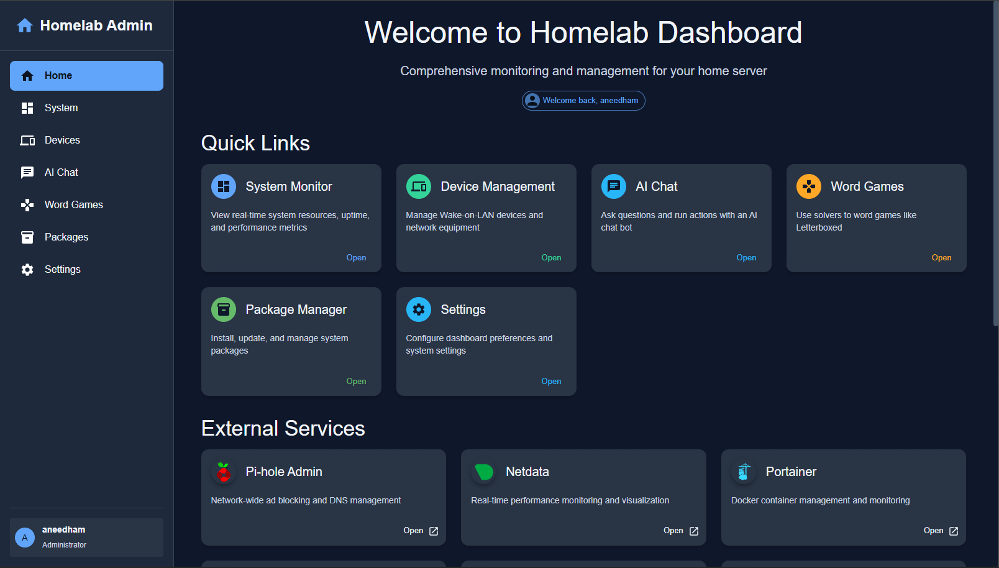

# 🏠 Homelab Dashboard & Services

This repository contains all the configuration and Docker instructions needed to deploy a comprehensive, self-hosted homelab system.


## 📚 Table of Contents
- [Prerequisites](#-prerequisites)
- [Host Machine Configuration](#-host-machine-configuration)
- [Project Deployment](#-project-deployment)
- [Backup and Restore](#-backup-and-restore)
- [Post Installation Checklist](#-post-installation-checklist)
- [Development](#-development)
- [License](#️-license)


## ✨ Overview

This project bundles several open-source services, managed via `docker-compose`, and provides a custom web dashboard for easy management and interaction.



### Core Services Included

  * **Homelab Dashboard**: A custom web interface with:
      * LAN device scanning
      * Word game solver
      * Host package management (for Arch Linux)
      * An integrated AI chatbot
  * **🛡️ Authelia**: Single Sign-On (SSO) for securing services.
  * **📊 Netdata**: Real-time performance monitoring.
  * **🧩 Portainer**: Docker container management UI.
  * **📈 Uptime Kuma**: Service monitoring and status pages.
  * **🔔 Ntfy**: Push notifications for alerts.
  * **🚫 Pi-hole & Unbound**: Network-wide ad-blocking and recursive DNS.
  * **🌐 ddclient**: Dynamic DNS client to keep your domain pointed to your IP.
  * **🖥️ RustDesk**: A self-hosted remote desktop solution.


## 📋 Prerequisites

This project is meant for Arch Linux systems using the `pacman` package manager.
Services will run on other operating systems, but the Homelab Dashboard Host API will not function properly.
Before you begin, ensure the following packages are installed on your Arch Linux host:

```shell
sudo pacman -S openssl apache sed grep xargs docker jq lm_sensors arp-scan
```

  * After installing `lm_sensors`, run `sudo sensors-detect` to initialize it.
  * The `apache` package is needed for the `htpasswd` utility used by the setup script.


## 💻 Host Machine Configuration

Follow these steps to prepare the host server.

### 1\. SSH Setup 🔒

For better security, it's recommended to use a non-default SSH port.

  * **Optional**: Change the SSH port from `22` to `2222` in your `/etc/ssh/sshd_config`.
  * Ensure your new port is opened in the firewall rules below.
  * [OpenSSH Docs 🔗](https://wiki.archlinux.org/title/OpenSSH)

### 2\. Firewall (UFW) Setup 🧱

These rules assume your LAN is `10.10.10.0/24` and your VPN is `10.10.20.0/24`. Adjust as needed.

First, set the default policies:

```shell
sudo ufw default deny incoming
sudo ufw default allow outgoing
sudo ufw default deny routed
```

Then, apply the following rules for your services:

| To | Action | From | Description |
| :--- | :---: | :--- | :--- |
| **VPN Traffic** |
| Anywhere on `wg0` | `ALLOW IN` | `10.10.20.0/24` | Allow all VPN traffic on the WireGuard interface |
| `51820/udp` | `ALLOW IN` | `Anywhere` | WireGuard VPN Endpoint (IPv4 & v6) |
| **LAN Access** |
| `2222/tcp` | `ALLOW IN` | `10.10.10.0/24` | SSH from LAN |
| `80,443/tcp` | `ALLOW IN` | `10.10.10.0/24` | Web services from LAN |
| `53` | `ALLOW IN` | `10.10.10.0/24` | DNS (Pi-hole) from LAN |
| `21114:21119/tcp` | `ALLOW IN` | `10.10.10.0/24` | RustDesk from LAN |
| `21116/udp` | `ALLOW IN` | `10.10.10.0/24` | RustDesk from LAN |
| **VPN Access** |
| `2222/tcp` | `ALLOW IN` | `10.10.20.0/24` | SSH from VPN |
| `80,443/tcp` | `ALLOW IN` | `10.10.20.0/24` | Web services from VPN |
| `53` | `ALLOW IN` | `10.10.20.0/24` | DNS (Pi-hole) from VPN |
| `21114:21119/tcp` | `ALLOW IN` | `10.10.20.0/24` | RustDesk from VPN |
| `21116/udp` | `ALLOW IN` | `10.10.20.0/24` | RustDesk from VPN |

Finally, copy the custom rules file which includes forwarding rules for Docker and WireGuard:

  * Copy [`./ufw/before.rules`](./ufw/before.rules) to `/etc/ufw/before.rules`
  * [UFW Docs 🔗](https://wiki.archlinux.org/title/Uncomplicated_Firewall)

Then run this command to enable the firewall.

```shell
# Applies and enables all firewall rules
sudo ufw reload
```

### 3\. WireGuard VPN Setup 🌐

1.  **Configuration**: Copy the example config from [`./wireguard/wg0.conf`](./wireguard/wg0.conf) to `/etc/wireguard/wg0.conf` and edit it with your keys and peer information.
2.  **Enable IP Forwarding**: Create `/etc/sysctl.d/40-ipv4-forward.conf` and add the line `net.ipv4.ip_forward = 1`.
3.  **Router Setup**: Configure your internet router to port forward UDP `51820` to your host machine.

<!-- end list -->

  * [WireGuard Docs 🔗](https://www.wireguard.com/quickstart/)

Apply changes with these commands.

```shell
# Reloads all kernel parameters from /etc/sysctl.d/
sudo sysctl --system

# Restarts the wg0 interface to apply the new config
sudo systemctl restart wg-quick@wg0.service
```

### 4\. DNS Configuration

1.  **`dhcpcd.conf`**: Copy [`./dns/dhcpcd.conf`](./dns/dhcpcd.conf) to `/etc/dhcpcd.conf`. This prevents the DHCP client from overwriting your custom DNS settings.
2.  **`resolv.conf`**: Copy [`./dns/resolv.conf`](./dns/resolv.conf) to `/etc/resolv.conf`. This prioritizes the local Pi-hole resolver (`127.0.0.1`).
3.  **`resolved.conf`**: Copy [`./resolved.conf`](./resolved.conf) to `/etc/systemd/resolved.conf`. This disables the systemd stub listener on port 53, freeing it up for Pi-hole.

Apply changes with these commands.

```shell
# Restarts the systemd service that handles DNS resolution
sudo systemctl restart systemd-resolved.service

# Restarts the DHCP client daemon to apply its new configuration
sudo systemctl restart dhcpcd.service
```

## 🚀 Project Deployment

Once the host is configured, follow these steps to deploy the services.

### 1\. Clone & Initialize 📂

Clone this repository and its submodules.

```shell
git clone https://github.com/satsinush/homelab.git
cd homelab
git submodule init
git submodule update
```

  * [Git Docs 🔗](https://docs.github.com/en/get-started/using-git)

### 2\. Configure Environment 📝

1.  **Dynamic DNS**
      * If you use a DDNS service, copy [`./ddclient/example.ddclient.conf`](./ddclient/example.ddclient.conf) to `./volumes/ddclient/ddclient.conf` and fill in your provider's details.
      * [ddclient Docs 🔗](https://ddclient.net/)
2.  **Environment Variables**
      * Carefully review and update all values, especially `HOMELAB_IP_ADDRESS` and any hostnames.
      * Values in `<angle_brackets>` will be replaced automatically by the setup script.

### 3\. Run the Setup Script ⚡

Execute the main setup script. It will prompt you to create a username and password and automatically configure and initialize all the services.

```shell
./setup.sh
```

### 4\. Enable Systemd Services ⚙️

Copy the provided service files to enable the host API and an automatic package update timer.
These are necessary for the device scanner and package manager to function.

  * **Host API**: Copy [`./systemd/homelab-host-api.service`](./systemd/homelab-host-api.service) to `/etc/systemd/system/`
  * **Pacman Sync**: Copy [`./systemd/pacman-sync.service`](./systemd/pacman-sync.service) and [`./systemd/pacman-sync.timer`](./systemd/pacman-sync.timer) to `/etc/systemd/system/`

Then, start and enable the services:

```shell
# Host API
sudo systemctl start homelab-host-api
sudo systemctl enable homelab-host-api

# Pacman Sync Timer
sudo systemctl start pacman-sync.timer
sudo systemctl enable pacman-sync.timer
```

  * [Systemd Docs 🔗](https://wiki.archlinux.org/title/Systemd#Basic_systemctl_usage)


## ✅ Post-Installation Checklist

Final configuration steps for individual services.

  * **📜 CA Certificate**: Install the generated `homelab-ca.crt` (found in [`./volumes/certificates`](./volumes/certificates/)) on all your client devices to avoid browser security warnings.
  * **🔑 Vaultwarden**: Create your primary account. Afterwards, set `VAULTWARDEN_SIGNUPS_ALLOWED=false` in your `.env` and restart the container (`docker compose up -d --build --force-recreate vaultwarden`) to disable public registration.
      * [Vaultwarden Docs 🔗](https://github.com/dani-garcia/vaultwarden/blob/main/README.md)
  * **📈 Uptime Kuma**: Configure notifications to point to your `ntfy` service using the token from `NTFY_ADMIN_TOKENS` in the `.env` file.
      * Copy [`./uptime-kuma/example-data/kuma.db`](./uptime-kuma/example-data/kuma.db) to `./volumes/uptime-kuma/example-data/kuma.db`
      * [Uptime Kuma Docs 🔗](https://github.com/louislam/uptime-kuma/wiki)
  * **🔔 Ntfy**: Subscribe to the `homelab-dashboard` and `uptime-kuma` topics on your clients for alerts.
      * [Ntfy Docs 🔗](https://docs.ntfy.sh/)
  * **🖥️ RustDesk**: Configure your clients by setting the **ID/Relay Server** to your host's IP/domain. The required public key is at [`./volumes/rustdesk/data/id_ed25519.pub`](./volumes/rustdesk/data/id_ed25519.pub).
      * [RustDesk Docs 🔗](https://rustdesk.com/docs/)
  * **🚫 Pi-hole**: For best results, consider replacing the default adlists with a more lest strict list, such as the [Hagezi Pro list](https://raw.githubusercontent.com/hagezi/dns-blocklists/main/adblock/pro.txt).
      * [Pi-hole Docs 🔗](https://docs.pi-hole.net/)
  * **🛡️ Authelia**: If you need to recover an account, you can retrieve email verification codes by running `docker exec authelia cat /var/lib/authelia/notification.txt`.
      * [Authelia Docs 🔗](https://www.authelia.com/integration/prologue/get-started/)


## 💾 Backup and Restore

This project includes a script, [`backup.sh`](./backup.sh), to simplify the backup and restore process. It backs up all essential data, including local configurations, bind mounts (`./volumes`), and Docker named volumes.

### Creating a Backup

Run the script with the `backup` command. This will stop your services, create a timestamped backup directory in `./backups`, archive all data, and restart your services.

```shell
sudo ./backup.sh backup
```

### Restoring from a Backup

⚠️ **Warning:** The restore process is destructive and will overwrite your current data.

A clean restore requires following these steps in order:

1.  **Full Teardown**: Completely remove the old stack and its volumes.
    ```shell
    docker compose down -v
    ```
2.  **Run the Restore Script**: Use `backup.sh` to populate the new volumes with your backup data.
    ```shell
    # Replace with the path to your actual backup folder
    sudo ./backup.sh restore ./backups/homelab-backup-YYYY-MM-DD_HH-MM-SS/
    ```

### Important Notes

  * The `./backups` directory should be added to your `.gitignore` file.
  * For true disaster recovery, you should regularly copy the contents of your `./backups` folder to an off-site location (e.g., cloud storage, a separate NAS, or an external drive).


## 🧑‍💻 Development

This project supports a development environment with hot-reloading for the dashboard frontend and backend. This is achieved using a `docker-compose.override.yml` file.

### Frontend and API (Dashboard)

1.  **Enable Development Mode**: To start, make a copy of the example override file.
    ```shell
    cp example.docker-compose.override.yml docker-compose.override.yml
    ```
2.  **Start the Stack**: Launch the services. `docker compose` will automatically detect and use both files.
    ```shell
    docker compose up -d --build --force-recreate
    ```

This development setup starts a separate `dashboard-dev` container running the Vite dev server for the frontend. The main `homelab-dashboard` backend container uses `nodemon` to watch for file changes. Any updates to the API or frontend source code will be updated automatically in the running containers.

### Host API

To work on the Host API locally with hot-reloading, you can run it directly on your Arch Linux host.

```shell
# Navigate to the host API directory
cd ./homelab-dashboard/host-api/

# Install dependencies
npm install

# Start the dev server with nodemon
npm run dev
```

### Exiting Development Mode

To return to the standard production build, simply stop the containers and remove the override file.

```shell
docker compose down
rm docker-compose.override.yml
```


## ⚖️ License

This project is licensed under the MIT License. See the [`./LICENSE`](./LICENSE) file for details.

> **Note**: The software for each containerized service falls under its own respective license. The MIT license for this repository applies only to the original configuration files, scripts, and the `homelab-dashboard` source code.
