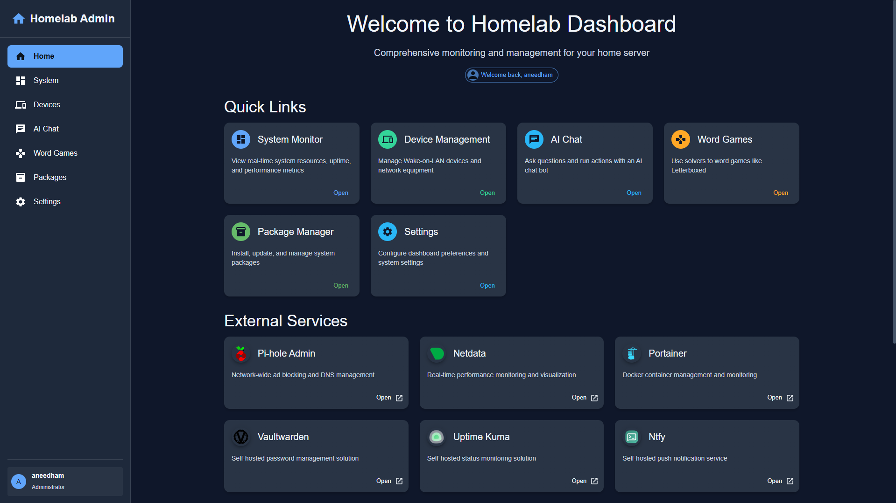

# 🏠 Homelab Dashboard & Services

This repository contains all the configuration and Docker instructions needed to deploy a comprehensive, self-hosted homelab system.

<p align="center">
  
  
  
</p>

## 📚 Table of Contents
- [Prerequisites](#-prerequisites)
- [Host Machine Configuration](#-host-machine-configuration)
- [Project Deployment](#-project-deployment)
- [Backup and Restore](#-backup-and-restore)
- [Post Installation Checklist](#-post-installation-checklist)
- [Development](#-development)
- [License](#️-license)

## ✨ Overview

This project bundles several open-source services, managed via `docker-compose`, and provides a custom web dashboard for easy management and interaction.



### Core Services Included

  * **🏠 Homelab Dashboard**: A custom web interface with:
      * LAN device scanning and WOL support
      * Word puzzle game solver
      * Host device package management (for *pacman*)
      * An integrated AI chatbot
  * **🛡️ Authelia**: Single Sign-On (SSO) for securing services.
  * **📊 Netdata**: Real-time performance monitoring.
  * **📦 Portainer**: Docker container management UI.
  * **📈 Uptime Kuma**: Service monitoring and status pages.
  * **🔔 Ntfy**: Push notifications for alerts.
  * **🚫 Pi-hole & Unbound**: Network-wide ad-blocking and recursive DNS.
  * **🌐 ddclient**: Dynamic DNS client to keep your domain pointed to your IP.
  * **🖥️ RustDesk**: A self-hosted remote desktop solution.
  * **🔑 Vaultwarden**: Self-hosted password manager.

## Infrastructure Diagram


## 📋 Prerequisites

This project is meant for Arch Linux systems using the `pacman` package manager.
Services will run on other operating systems with different package managers, but the installation instructions will be different and the Homelab Dashboard Host API will not function properly.
Before you begin, ensure your device is up to date and that the following packages are installed on your Arch Linux host:

```shell
sudo pacman -Syu
sudo pacman -S openssl apache sed grep xargs docker jq lm_sensors arp-scan
```

  * After installing `lm_sensors`, run `sudo sensors-detect` to initialize it.
  * The `apache` package is needed for the `htpasswd` utility used by the setup script.


## 💻 Host Machine Configuration

Follow these steps to prepare the host server.

### 1\. SSH Setup 🔒

For better security, it's recommended to use a non-default SSH port.

  * **Optional**: Change the SSH port from `22` to `2222` in your `/etc/ssh/sshd_config`.
  * Ensure your new port is opened in the firewall rules below.
  * [OpenSSH Docs 🔗](https://wiki.archlinux.org/title/OpenSSH)

### 2\. Firewall (UFW) Setup 🧱

These rules assume your LAN is `10.10.10.0/24` and your VPN is `10.10.20.0/24`. Adjust as needed.

First, set the default policies:

```shell
sudo ufw default deny incoming
sudo ufw default allow outgoing
sudo ufw default deny routed
```

Then, apply the following rules for your services:

| To | Action | From | Description |
| :--- | :---: | :--- | :--- |
| **VPN Traffic** |
| Anywhere on `wg0` | `ALLOW IN` | `10.10.20.0/24` | Allow all VPN traffic on the WireGuard interface |
| `51820/udp` | `ALLOW IN` | `Anywhere` | WireGuard VPN Endpoint (IPv4 & v6) |
| **LAN Access** |
| `2222/tcp` | `ALLOW IN` | `10.10.10.0/24` | SSH from LAN |
| `80,443/tcp` | `ALLOW IN` | `10.10.10.0/24` | Web services from LAN |
| `53` | `ALLOW IN` | `10.10.10.0/24` | DNS (Pi-hole) from LAN |
| `21114:21119/tcp` | `ALLOW IN` | `10.10.10.0/24` | RustDesk from LAN |
| `21116/udp` | `ALLOW IN` | `10.10.10.0/24` | RustDesk from LAN |
| **VPN Access** |
| `2222/tcp` | `ALLOW IN` | `10.10.20.0/24` | SSH from VPN |
| `80,443/tcp` | `ALLOW IN` | `10.10.20.0/24` | Web services from VPN |
| `53` | `ALLOW IN` | `10.10.20.0/24` | DNS (Pi-hole) from VPN |
| `21114:21119/tcp` | `ALLOW IN` | `10.10.20.0/24` | RustDesk from VPN |
| `21116/udp` | `ALLOW IN` | `10.10.20.0/24` | RustDesk from VPN |

Finally, copy the custom rules file which includes forwarding rules for Docker and WireGuard:

  * Copy [`./ufw/before.rules`](./ufw/before.rules) to `/etc/ufw/before.rules`
  * [UFW Docs 🔗](https://wiki.archlinux.org/title/Uncomplicated_Firewall)

Then run this command to enable the firewall.

```shell
# Applies and enables all firewall rules
sudo ufw reload
```

### 3\. WireGuard VPN Setup 🌐

1.  **Configuration**: Copy the example config from [`./wireguard/wg0.conf`](./wireguard/wg0.conf) to `/etc/wireguard/wg0.conf` and edit it with your keys and peer information.
2.  **Enable IP Forwarding**: Create `/etc/sysctl.d/40-ipv4-forward.conf` and add the line `net.ipv4.ip_forward = 1`.
3.  **Router Setup**: Configure your internet router to port forward UDP `51820` to your host machine.

<!-- end list -->

  * [WireGuard Docs 🔗](https://www.wireguard.com/quickstart/)

Apply changes with these commands.

```shell
# Reloads all kernel parameters from /etc/sysctl.d/
sudo sysctl --system

# Restarts the wg0 interface to apply the new config
sudo systemctl restart wg-quick@wg0.service
```

### 4\. DNS Configuration

1.  **`dhcpcd.conf`**: Configure `/etc/dhcpcd.conf` to prevent the DHCP client from overwriting your custom DNS settings. See [`./dns/dhcpcd.conf`](./dns/dhcpcd.conf) as an example.
2.  **`resolv.conf`**: Configure `/etc/resolv.conf` to prioritize the local Pi-hole resolver while providing a backup DNS for when Pi-hole is not running. See [`./dns/resolv.conf`](./dns/resolv.conf) as an example.
3.  **`resolved.conf`**: Configure `/etc/systemd/resolved.conf` to disable the systemd stub listener on port 53, freeing it up for Pi-hole. See [`./resolved.conf`](./resolved.conf) as an example.

Apply changes with these commands.

```shell
# Restarts the systemd service that handles DNS resolution
sudo systemctl restart systemd-resolved.service

# Restarts the DHCP client daemon to apply its new configuration
sudo systemctl restart dhcpcd.service
```

## 🚀 Project Deployment

Once the host is configured, follow these steps to deploy the services.

### 1\. Clone & Initialize 📂

Clone this repository and its submodules.

```shell
git clone https://github.com/satsinush/homelab.git
cd homelab
git submodule init
git submodule update
```

  * [Git Docs 🔗](https://docs.github.com/en/get-started/using-git)

### 2\. Configure Environment 📝

1.  **Dynamic DNS**
      * If you use a DDNS service, make sure to copy [`./ddclient/example.ddclient.conf`](./ddclient/example.ddclient.conf) to `./ddclient/ddclient.conf` and fill in your provider's details.
      * [ddclient Docs 🔗](https://ddclient.net/)
2.  **Environment Variables**
      * Carefully review and update all values, especially `HOMELAB_IP_ADDRESS` and any hostnames.
      * Values in `<angle_brackets>` will be replaced automatically by the setup script.

### 3\. Run the Setup Script ⚡

Execute the main setup script. It will prompt you to create a username and password and automatically configure and initialize all the services.

```shell
./setup.sh
```

> **Note**: The setup script creates a user-specific email address. You **must** use this email for services like Vaultwarden and Authelia to receive notifications via Ntfy. Your notification topic in Ntfy is `YOUR USERNAME`.

> **Tip**: You can run this script again at any time to recreate SSL certificates. The CA certificate will not be affected and all other settings will stay the same.

### 4\. Enable Systemd Services ⚙️

To complete the server setup, you'll need to configure and enable a few custom `systemd` services. These manage the host API, automatic package updates, and automated backups.

#### **Step 1: Configure the Service Files**

Before copying the files, you must edit them to match your user and home directory.

1.  Open `./systemd/system/homelab-host-api.service`.
2.  Open `./systemd/system/homelab-backup.service`.

In both files, find and replace the placeholder `user` with your actual username (e.g., `aneedham`).

#### **Step 2: Copy the Files to Systemd**

Once you've saved your edits, copy all the unit files to the systemd directory.

```shell
sudo cp -rv ./systemd/system/* /etc/systemd/system/
```

#### **Step 3: Reload Daemon and Enable Services**

First, tell `systemd` to re-read its configuration to detect the new files.

```shell
sudo systemctl daemon-reload
```

Next, enable and start the new services and timers. The `enable --now` command starts them immediately and also ensures they launch automatically on boot.

```shell
# Custom Services
sudo systemctl enable --now homelab-host-api.service
sudo systemctl enable --now pacman-sync.timer
sudo systemctl enable --now homelab-backup.timer
```

Finally, ensure the system's time synchronization service is active, as accurate time is crucial for many services.

```shell
# Enable and start the time sync service
sudo systemctl enable --now systemd-timesyncd

# Check the status
timedatectl status
```

> If **`System clock synchronized`** shows **`no`**, you may need to edit `/etc/systemd/timesyncd.conf` to configure a reliable time source. Check [`./systemd/timesyncd.conf`](./systemd/timesyncd.conf) for an example. After editing, restart the service with `sudo systemctl restart systemd-timesyncd`.

-----

  * [Systemd Docs 🔗](https://wiki.archlinux.org/title/Systemd#Basic_systemctl_usage)


## ✅ Post-Installation Checklist

Final configuration steps for individual services.

  * **📜 CA Certificate**
    * Install the generated `homelab-ca.crt` (found in [`./volumes/certificates`](./volumes/certificates/)) on all your client devices to avoid browser security warnings.
  * **🔑 Vaultwarden**
    * Create your primary account. You **must** use the email provided to you by the set up script, otherwise ntfy will not create notifcations for password reset emails and you may lose access to your account. Afterwards, you can optionally set `VAULTWARDEN_SIGNUPS_ALLOWED=false` in your `.env` and restart the container to disable public registration.
    * [Vaultwarden Docs 🔗](https://github.com/dani-garcia/vaultwarden/blob/main/README.md)
  * **📈 Uptime Kuma**
    * Configure notifications to point to your `ntfy` service using the token from `NTFY_ADMIN_TOKENS` in the `.env` file.
    * [Uptime Kuma Docs 🔗](https://github.com/louislam/uptime-kuma/wiki)
  * **🔔 Ntfy**
    * Set the URL to your ntfy domain and log into ntfy with your homelab username and password.
    * Subscribe to the following topics:
      * `homelab-dashboard` topic for package updates.
      * `uptime-kuma` topic for service alerts.
      * `YOUR USERNAME` topic for password reset emails.
    * [Ntfy Docs 🔗](https://docs.ntfy.sh/)
  * **🖥️ RustDesk**
    * Configure your clients by setting the **ID/Relay Server** to your host's IP/domain. The required public key is printed after running [`./setup.sh`](./setup.sh) or can be obtained by running this command: `docker cp rustdesk-id-server:/root/id_ed25519.pub - | tar -xO`
    * [RustDesk Docs 🔗](https://rustdesk.com/docs/)
  * **🚫 Pi-hole**
    * For best results, consider replacing the default adlists with a more lest strict list, such as the [Hagezi Pro list](https://raw.githubusercontent.com/hagezi/dns-blocklists/main/adblock/pro.txt).
    * [Pi-hole Docs 🔗](https://docs.pi-hole.net/)
  * **🛡️ Authelia**
    * If you need to recover an account, you can retrieve email verification codes by running subcribing to your `YOUR USERNAME` topic in ntfy.
      * [Authelia Docs 🔗](https://www.authelia.com/integration/prologue/get-started/)


## 💾 Backup and Restore

This project includes a powerful script, [`backup.sh`](https://www.google.com/search?q=./backup.sh), for both manual and automated backups. It archives all essential data—including local configurations, bind mounts (`./volumes`), and Docker named volumes—into a single, compressed `.tar.gz` file.

### Creating a Backup

The script supports two ways to create backups.

#### **Manual Backups**

To run a one-off manual backup at any time, use the `backup` command. This will temporarily stop your services, create a single timestamped archive in the `./backups` directory, and then restart everything.

```shell
sudo ./backup.sh backup
```

This will create a file like `./backups/homelab-backup-2025-08-20_19-05-00.tar.gz`.

### Automated Backups (Systemd Timer) 🗓️

This project uses a `systemd` timer for robust, automated backups. The `homelab-backup.timer` unit, which you enabled during setup, handles this process automatically.

By default, the timer is configured to:

  * Run the backup script with the `--auto` flag **daily at 3:00 AM**.
  * Store the archives in the `./backups/auto/` subdirectory.
  * Keep only the **last 7 backups**, deleting older ones automatically.

#### **Checking the Backup Timer Status**

You can check the status of all timers, including when the next backup is scheduled to run, with the following command:

```shell
systemctl list-timers
```

#### **Viewing Backup Logs**

To see the output from the last time the backup service ran, use `journalctl`:

```shell
sudo journalctl -u homelab-backup.service
```

#### **Changing the Schedule**

To change the backup frequency, edit the `OnCalendar=` line in `/etc/systemd/system/homelab-backup.timer` and then reload the systemd daemon with `sudo systemctl daemon-reload`.

-----

### Restoring from a Backup

⚠️ **Warning:** The restore process is destructive and will overwrite your current data.

For a completely clean restore, follow these steps:

1.  **Full Teardown (Optional):** Completely remove the old stack and all its volumes to prevent any conflicts with old data.
    ```shell
    docker compose down -v
    ```
2.  **Run the Restore Script**: Use the `restore` command, providing the path to the `.tar.gz` archive you want to restore from. The script will handle the rest of the process.
    ```shell
    # Replace with the path to your actual backup archive
    sudo ./backup.sh restore ./backups/auto/homelab-backup-2025-08-20_19-05-00.tar.gz
    ```

-----

### Important Notes

  * The `./backups` directory should be added to your `.gitignore` file.
  * For true disaster recovery, you should regularly copy your backups to an off-site location (e.g., cloud storage, a separate NAS, or an external drive).


## 🧑‍💻 Development

This project supports a development environment with hot-reloading for the dashboard frontend and backend. This is achieved using a `docker-compose.override.yml` file.

### Frontend and API (Dashboard)

1.  **Enable Development Mode**: To start, make a copy of the example override file.
    ```shell
    cp example.docker-compose.override.yml docker-compose.override.yml
    ```
2.  **Start the Stack**: Launch the services. `docker compose` will automatically detect and use both files.
    ```shell
    docker compose up -d --build --force-recreate
    ```

This development setup starts a separate `dashboard-dev` container running the Vite dev server for the frontend. The main `homelab-dashboard` backend container uses `nodemon` to watch for file changes. Any updates to the API or frontend source code will be updated automatically in the running containers.

You should set the DNS server for your development device to 127.0.0.1 in order to test the pages with their actual domain names.

### Host API

To work on the Host API locally with hot-reloading, you can run it directly on your Arch Linux host.

```shell
# Navigate to the host API directory
cd ./homelab-dashboard/host-api/

# Install dependencies
npm install

# Start the dev server with nodemon
npm run dev
```

## ❓ Troubleshooting

This section covers common issues you might encounter and how to resolve them.

### A service is unreachable or a domain won't resolve

This usually indicates a problem with DNS or the firewall.

  * **1. Check Client DNS:** Ensure the device you are using has its DNS server set to the IP address of your Pi-hole. You can test if the domain is resolving correctly by running `ping vaultwarden.your.domain`. It should return the IP of your homelab server.
  * **2. Check Firewall Rules:** Verify that your firewall is not blocking the connection. Run `sudo ufw status` on the server and make sure the necessary ports (like `80`, `443`, `53`) are allowed from your IP address or subnet.

-----

### My browser shows a security warning (e.g., "Your connection is not private")

This happens because your browser doesn't trust your self-generated Certificate Authority (CA).

  * **Solution:** You must install the root CA certificate on all devices that will access the homelab services. The certificate is located at `./volumes/certificates/homelab-ca.crt`. Import this file into your browser's or operating system's trust store.

-----

### A webpage is behaving strangely, not updating, or I'm in a login loop

This is almost always caused by your browser's cache or old cookies, especially with an SSO system like Authelia.

  * **1. Force Refresh:** The quickest fix is to bypass the cache with a hard refresh. Press **`Ctrl+F5`** (or **`Cmd+Shift+R`** on Mac).
  * **2. Clear Site Data:** If a hard refresh doesn't work, clear the cookies and site data for the specific domain in your browser's settings and try again.

-----

### A container is failing to start or is in a restart loop

This typically points to a misconfiguration in your `.env` file, a port conflict, or a file permission issue.

  * **Solution:** The definitive way to diagnose this is to check the container's logs. Run the following command, replacing `<container-name>` with the name of the failing service (e.g., `vaultwarden`).
    ```shell
    docker compose logs <container-name>
    ```
    Look for any lines that start with `Error`, `Fatal`, or mention `Permission Denied`.

-----

### I'm seeing a HTTP error like '502 Bad Gateway'

These errors mean the request reached your reverse proxy (e.g., Nginx, Traefik), but it couldn't be completed.

  * **Cause (502 Bad Gateway):** The reverse proxy has a rule, but it cannot communicate with the backend service container. This usually means the service container is stopped, unhealthy, or not on the same Docker network.

  * **Solution:** Check the logs of your reverse proxy container for specific error messages.

    ```shell
    docker compose logs <your-reverse-proxy-container>
    ```

## ⚖️ License

This project is licensed under the MIT License. See the [`./LICENSE`](./LICENSE) file for details.

> **Note**: The software for each containerized service falls under its own respective license. The MIT license for this repository applies only to the original configuration files, scripts, and the `homelab-dashboard` source code.
