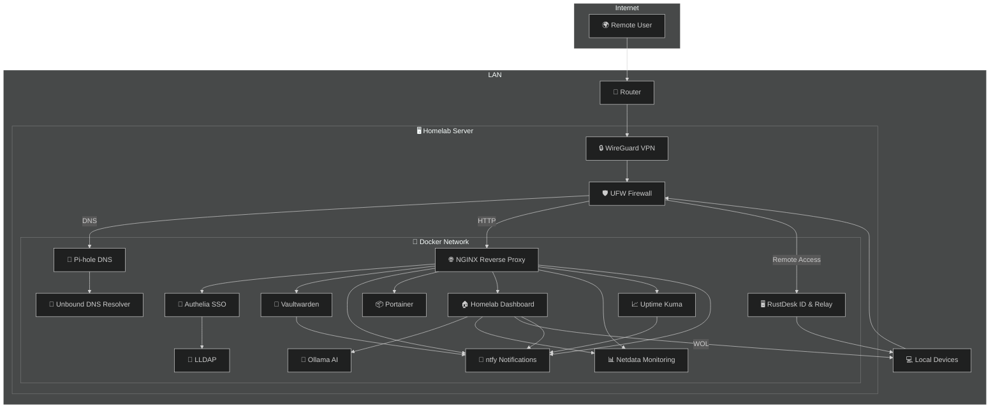

# 🏠 Homelab Dashboard & Services

This repository contains all the configuration and Docker instructions needed to deploy a comprehensive, self-hosted homelab system.

<p align="center">
  <a href="LICENSE">
    
  </a>
  <a href="https://docs.docker.com/compose/">
    
  </a>
  <a href="https://archlinux.org/">
    
  </a>
</p>

## 📚 Table of Contents
- [Overview](#-overview)
- [Quick Start Guide](#-get-started-quick-setup-guide)
- [License](#️-license)

## ✨ Overview

This project bundles several open-source services, managed via `docker-compose`, and provides a custom web dashboard for easy management and interaction.


### Core Services Included

  * **🏠 Homelab Dashboard**: A custom web interface with:
      * 💻 LAN device scanning and WOL support
      * 🧩 Word puzzle game solvers (Wordle, Mastermind, Hangman, Dungleon, Letter Boxed, Spelling Bee)
      * 📦 Host device package management (for *pacman*)
      * 🤖 An integrated AI chatbot with Ollama
  * **🔑 Authelia**: Single Sign-On (SSO) for securing services.
  * **📊 Netdata**: Real-time performance monitoring.
  * **📦 Portainer**: Docker container management UI.
  * **📈 Uptime Kuma**: Service monitoring and status pages.
  * **🔔 Ntfy**: Push notifications for alerts.
  * **🚫 Pi-hole & Unbound**: Network-wide ad-blocking and recursive DNS.
  * **🌐 ddclient**: Dynamic DNS client to keep your domain pointed to your IP.
  * **🖥️ RustDesk**: A self-hosted remote desktop solution.
  * **🔐 Vaultwarden**: Self-hosted password manager.

### Infrastructure Diagram



## 🚀 Quick Start Guide

Deployment is a multi-stage process. Follow these steps sequentially to prepare your host, configure services, and launch your homelab stack.

### 1\. 📂 Clone & Initialize

First, clone this repository and its submodules.

```shell
git clone https://github.com/satsinush/homelab.git
cd homelab
git submodule init
git submodule update
```

For more info see the [GitHub Docs 🔗](https://docs.github.com/en/get-started/using-git)

### 2\. 📋 Install Host Prerequisites

Before running any configuration scripts, install all base dependencies on your Arch Linux host, including Docker, UFW, and WireGuard tools.

➡️ **Follow the detailed instructions here:** **[1. Prerequisites](./docs/1-prerequisites.md)**

### 3\. ⚙️ Configure and Harden Host

This is the most critical security phase. You will configure SSH key access, set up the UFW firewall rules, and establish the WireGuard VPN tunnel.

➡️ **Follow the detailed instructions here:** **[2. Host Machine Configuration](./docs/2-host-config.md)**

### 4\. 🚀 Deploy the Services

The final deployment involves configuring environment variables, setting up custom `systemd` services for automation, and launching the Docker stack.

1.  **Configure Environment:** Adjust values in the `.env.template` file.
2.  **Enable Systemd Services:** Copy and enable host API, backup, and sync services.
3.  **Run Setup Script:** Execute the main script to build containers and generate credentials.

➡️ **Follow the detailed instructions here:** **[3. Project Deployment](./docs/3-deployment.md)**

-----

### Post-Deployment and Maintenance Guides

Once the core stack is running, use these sections for ongoing maintenance and checks.

#### 5\. ✅ Post-Installation Checklist

Complete a final checklist for each service (e.g., installing the root CA certificate, setting up notifications in Uptime Kuma, and disabling public sign-ups for Vaultwarden).

➡️ **View the full checklist here:** **[4. Post Installation Checklist](./docs/4-checklist.md)**

#### 6\. 💾 Backup and Restore

Learn how to manage and protect your data. This section covers running manual backups, checking the automated `systemd` backup timer, and performing a full system restoration from an archive.

➡️ **View the backup and restore guide here:** **[5. Backup and Restore](./docs/5-backup-restore.md)**

#### 7\. 🧑‍💻 Development

If you plan to modify the Homelab Dashboard or Host API code, this guide explains how to use the `docker-compose.override.yml` file to launch a development environment with hot-reloading enabled.

➡️ **View the development guide here:** **[6. Development](./docs/6-development.md)**

#### 8\. ❓ Troubleshooting

Find quick solutions for common deployment issues, including DNS resolution failures, browser security warnings, and container restarts.

➡️ **View the troubleshooting guide here:** **[7. Troubleshooting](./docs/7-troubleshooting.md)**

## ⚖️ License

This project is licensed under the MIT License. See the [`./LICENSE`](./LICENSE) file for details.

> **ℹ️ Note**: The software for each containerized service falls under its own respective license. The MIT license for this repository applies only to the original configuration files, scripts, and the `homelab-dashboard` source code.
