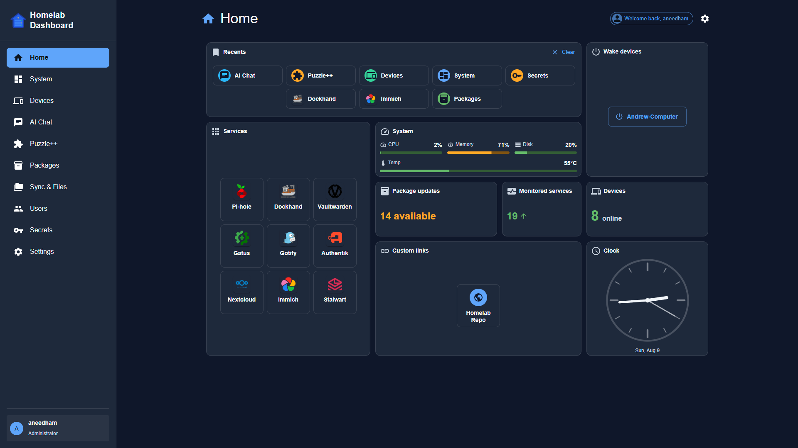
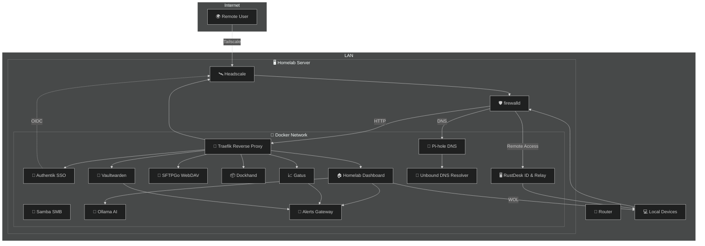

# 🏠 Homelab Dashboard & Services

This repository contains all the configuration and Docker instructions needed to deploy a comprehensive, self-hosted homelab system.

<p align="center">
  <a href="LICENSE">
    
  </a>
  <a href="https://docs.docker.com/compose/">
    
  </a>
  <a href="https://archlinux.org/">
    
  </a>
</p>

## 📚 Table of Contents
- [Overview](#-overview)
- [Quick Start Guide](#-get-started-quick-setup-guide)
- [License](#️-license)

## ✨ Overview

This project bundles several open-source services, managed via `docker-compose`, and provides a custom web dashboard for easy management and interaction.



### Core Services Included

  * **🏠 Homelab Dashboard**: A custom web interface with:
      * 💻 LAN device scanning and WOL support
      * 🧩 Word puzzle game solvers (Wordle, Mastermind, Hangman, Dungleon, Letter Boxed, Spelling Bee)
      * 📦 Host device package management (for *pacman*)
      * 🤖 An integrated AI chatbot with Ollama
  * **🔀 Traefik v3**: Cloud-native reverse proxy with automatic HTTPS (Let's Encrypt or self-signed).
  * **🔑 Authentik**: Single Sign-On (SSO) and Identity Provider for securing services.
  * **📊 Netdata**: Real-time performance monitoring.
  * **📦 Portainer**: Docker container management UI.
  * **📈 Uptime Kuma**: Service monitoring and status pages.
  * **🔔 Alerts**: HTTP and SMTP notification gateway (Apprise + Gotify) for Gatus, dashboard, Vaultwarden, and Dockhand.
  * **🚫 Pi-hole & Unbound**: Network-wide ad-blocking and recursive DNS.
  * **🌐 ddclient**: Dynamic DNS client to keep your domain pointed to your IP.
  * **🖥️ RustDesk**: Self-hosted remote desktop (ID + relay).
  * **📁 Samba + WebDAV**: LAN SMB and HTTPS WebDAV (SFTPGo) share local passwords in `volumes/file-accounts/accounts.env` on `./storage/users/` + `./storage/shared/`.
  * **🛰️ Headscale**: Self-hosted Tailscale control plane with Authentik OIDC sign-in; subnet router exposes the LAN to remote clients.
  * **🔐 Vaultwarden**: Self-hosted password manager.

### Infrastructure Diagram


```mermaid
%%{init: {
    "theme": "dark"
}}%%
graph TD
    %% INTERNET
    subgraph Internet
        RemoteClient[🌍 Remote User]
    end

    %% LAN
    subgraph LAN
        Router[📶 Router]
        LocalClient[💻 Local Devices]

        subgraph Server[🖥️ Homelab Server]
            Headscale[🛰️ Headscale]
            Firewall[🛡️ firewalld]

            subgraph Docker[🐳 Docker Network]
                Traefik[🔀 Traefik Reverse Proxy]
                Authentik[🔑 Authentik SSO]
                Vaultwarden[🔐 Vaultwarden]
                Samba[📁 Samba SMB]
                WebDAV[📂 SFTPGo WebDAV]
                Dockhand[📦 Dockhand]
                Dashboard[🏠 Homelab Dashboard]
                Ollama[🤖 Ollama AI]
                Gatus[📈 Gatus]
                Alerts[🔔 Alerts Gateway]
                Pihole[🚫 Pi-hole DNS]
                Unbound[🔎 Unbound DNS Resolver]
                Rustdesk[🖥️ RustDesk ID & Relay]
            end
        end
    end

    %% Entry chain
    RemoteClient -->|Tailscale| Headscale --> Firewall
    LocalClient --> Firewall

    %% DNS chain
    Pihole --> Unbound
    Firewall -->|DNS| Pihole

    %% Firewall routes
    Firewall -->|HTTP| Traefik
    Firewall -->|Remote Access| Rustdesk --> LocalClient

    %% Proxy/Auth flows
    Traefik --> Authentik
    Traefik --> Vaultwarden
    Traefik --> WebDAV
    Traefik --> Dockhand
    Traefik --> Dashboard
    Traefik --> Gatus
    Traefik --> Headscale
    Authentik -.->|OIDC| Headscale

    %% Dashboard flows
    Dashboard --> Ollama
    Dashboard -->|WOL| LocalClient
    Dashboard --> Alerts

    %% Notifications
    Gatus --> Alerts
    Vaultwarden --> Alerts
```

## 🚀 Quick Start Guide

Deployment is a multi-stage process. Follow these steps sequentially to prepare your host, configure services, and launch your homelab stack.

### 0\. 📂 Clone & Initialize

First, clone this repository and its submodules.

```shell
git clone https://github.com/satsinush/homelab.git
cd homelab
git submodule init
git submodule update
```

For more info see the [GitHub Docs 🔗](https://docs.github.com/en/get-started/using-git)

### 1\. 📋 Install Host Prerequisites

Before running any configuration scripts, install all base dependencies on your Arch Linux host, including Docker and host tooling.

➡️ **Follow the detailed instructions here:** **[1. Prerequisites](./docs/1-prerequisites.md)**

### 2\. ⚙️ Configure and Harden Host

This is the most critical security phase. You will configure SSH key access, set up firewalld rules, and prepare the host for Headscale / Tailscale remote access.

➡️ **Follow the detailed instructions here:** **[2. Host Machine Configuration](./docs/2-host-config.md)**

> **🅰️ Ansible alternative:** Steps 1 and 2 (packages, firewall, SSH, Docker, VPN host prep, host DNS) can be applied automatically with the playbook in [`ansible/`](./ansible/README.md). App setup below still uses `setup.py`.

### 3\. 🚀 Deploy the Services

The final deployment involves configuring environment variables, setting up custom `systemd` services for automation, and launching the Docker stack.

1.  **Configure Environment:** Adjust values in the `.env.template` file.
2.  **Enable Systemd Services:** Copy and enable host API, backup, and sync services.
3.  **Run Setup Script:** Execute the main script to build containers and generate credentials.

➡️ **Follow the detailed instructions here:** **[3. Project Deployment](./docs/3-deployment.md)**

-----

### Post-Deployment and Maintenance Guides

Once the core stack is running, use these sections for ongoing maintenance and checks.

#### 4\. ✅ Post-Installation Checklist

Complete a final checklist for each service (e.g., installing the root CA certificate, setting up notifications in Uptime Kuma, and disabling public sign-ups for Vaultwarden).

➡️ **View the full checklist here:** **[4. Post Installation Checklist](./docs/4-checklist.md)**

#### 5\. 💾 Backup and Restore

Learn how to manage and protect your data. This section covers Restic cloud backups via `setup.py`, the automated `systemd` timer, and disaster recovery.

➡️ **View the backup and restore guide here:** **[5. Backup and Restore](./docs/5-backup-restore.md)**

#### 6\. 🧑💻 Development

If you plan to modify the Homelab Dashboard or Host API code, this guide explains how to use the `docker-compose.override.yml` file to launch a development environment with hot-reloading enabled.

➡️ **View the development guide here:** **[6. Development](./docs/6-development.md)**

#### 7\. ❓ Troubleshooting

Find quick solutions for common deployment issues, including DNS resolution failures, browser security warnings, and container restarts.

➡️ **View the troubleshooting guide here:** **[7. Troubleshooting](./docs/7-troubleshooting.md)**

## ⚖️ License

This project is licensed under the MIT License. See the [`./LICENSE`](./LICENSE) file for details.

> **ℹ️ Note**: The software for each containerized service falls under its own respective license. The MIT license for this repository applies only to the original configuration files, scripts, and the `dashboard` source code.
