# 🖼️ Dashboard Screenshots Gallery

This gallery showcases all interface views of the Homelab Dashboard application.

---

## Dashboard Pages & Features

### 🏠 Home Overview

*Central dashboard home page displaying system status, service shortcuts, and high-level health indicators.*

---

### 💻 Devices & Wake-on-LAN
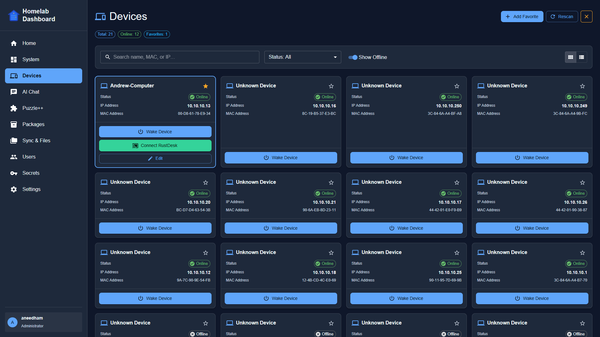
*Local network device scanner and Wake-on-LAN (WOL) management page.*

---

### 🤖 AI Chatbot (Ollama)
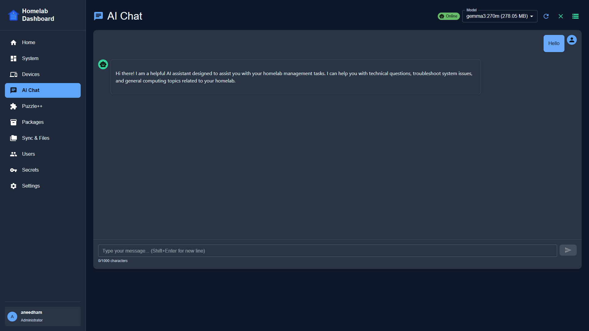
*Integrated AI Assistant powered locally by the containerized Ollama LLM server.*

---

### 🧩 Word Games - Wordle Solver
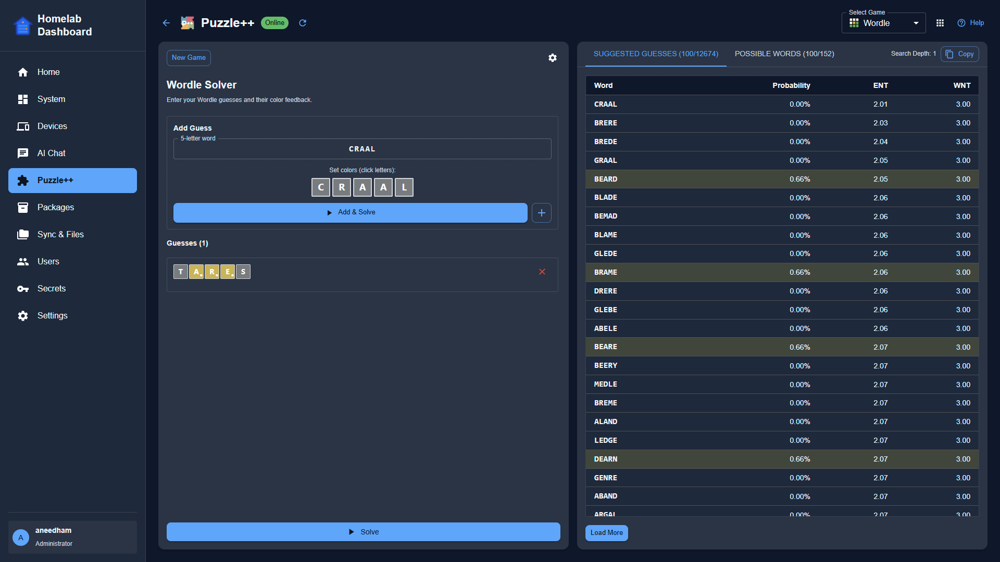
*Entropy-based move suggestions and interactive solver for Wordle.*

---

### 🧩 Word Games - Letter Boxed Solver
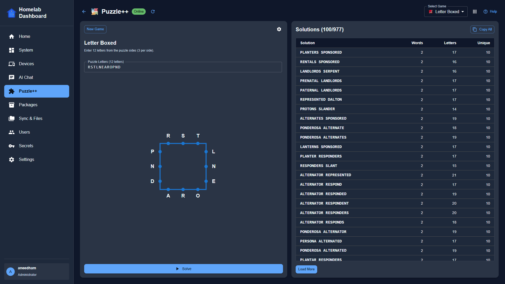
*Multi-word path finder and puzzle solver for NYT Letter Boxed.*

---

### 📦 Host Package Management
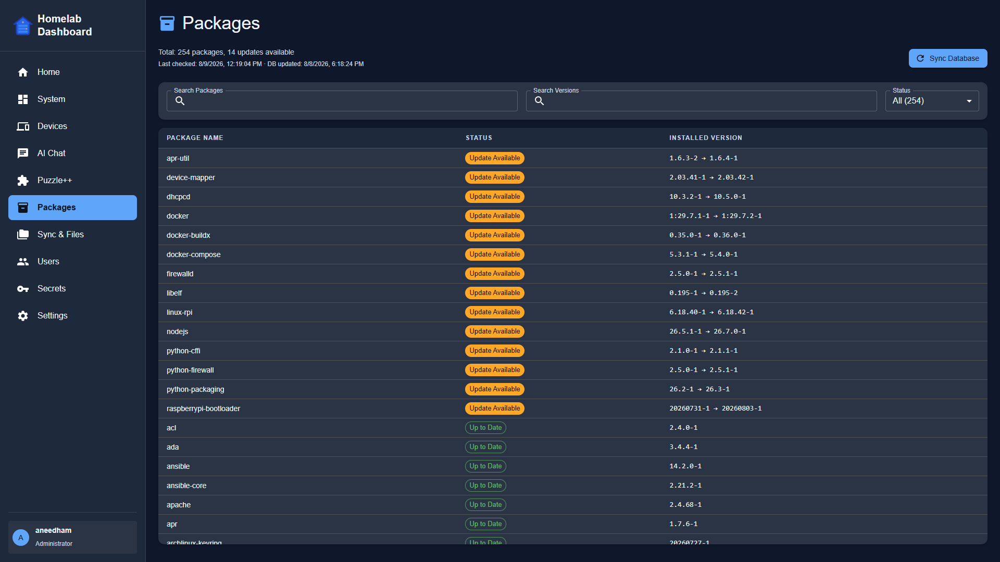
*Arch Linux `pacman` update monitoring, package search, and system sync interface.*

---

### 📁 File Browser
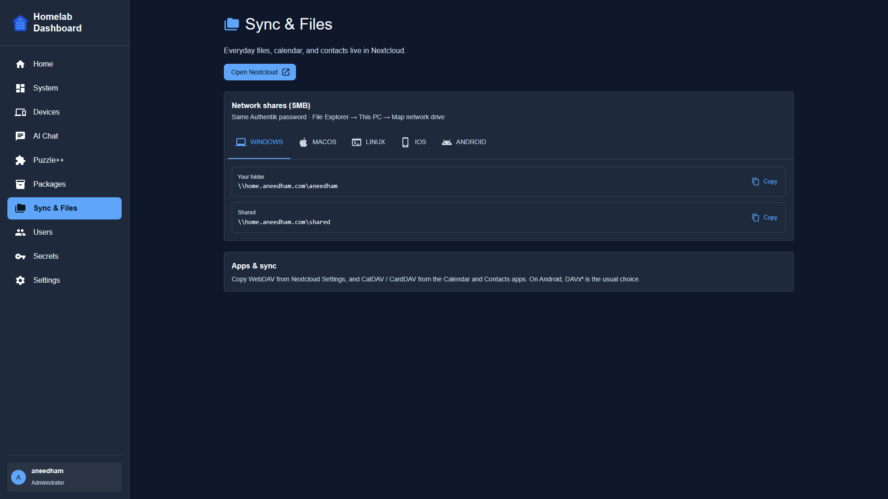
*Integrated file management view for exploring host storage directories.*

---

### 🔐 Secrets Manager
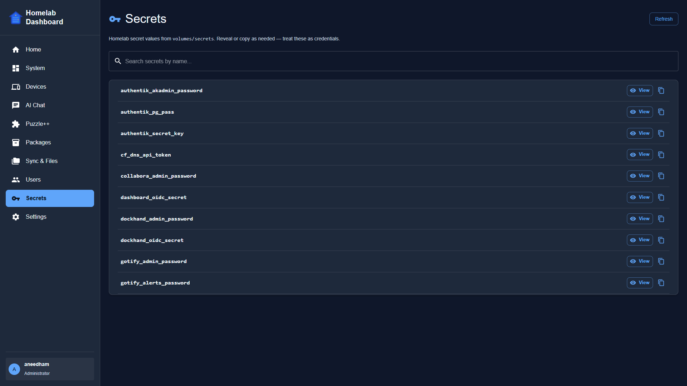
*View and manage environment credentials, passwords, and service secrets.*

---

### ⚙️ System Status & Hardware Metrics
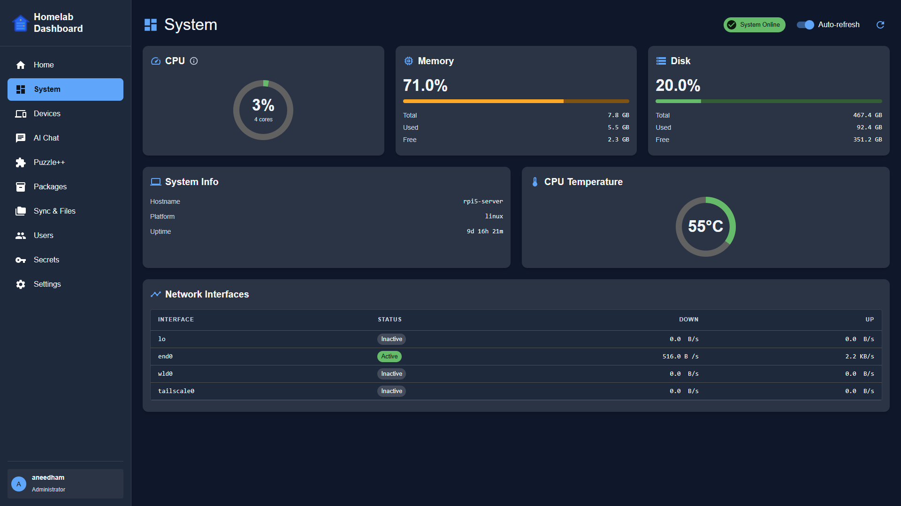
*Real-time hardware status, CPU/RAM usage, temperatures, and container health.*

---

### ⚙️ Dashboard Settings
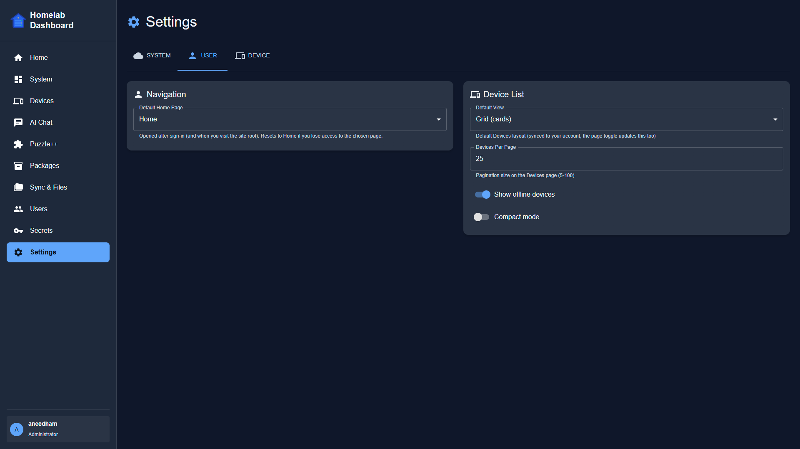
*User interface configuration, theme options, and dashboard application preferences.*

---

### 👤 User Profile
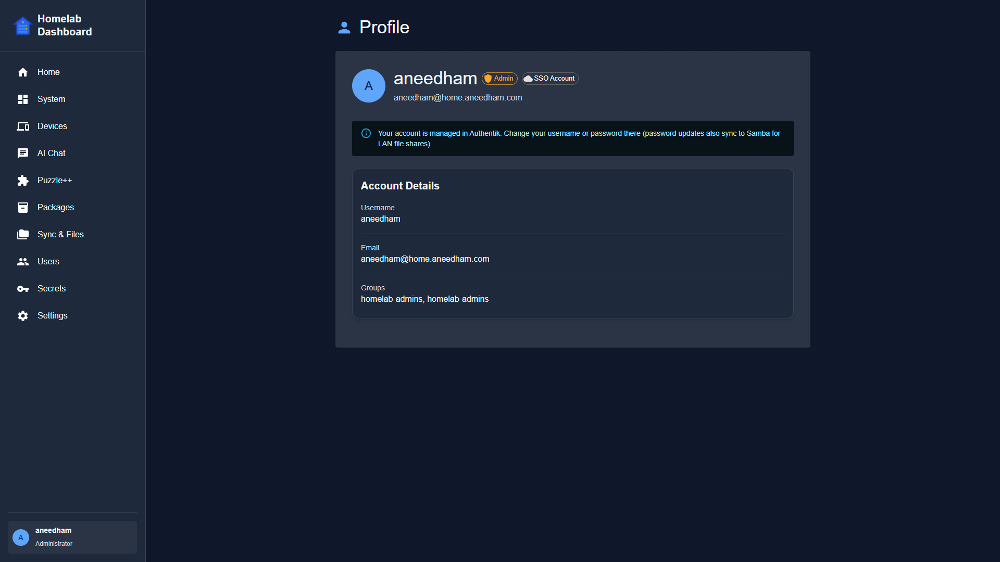
*User account settings, Authentik session information, and user role configuration.*

---

### 👥 User Administration
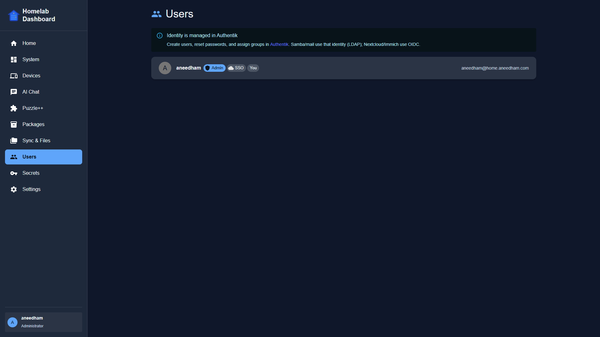
*User account management, group assignment, and permissions view for administrators.*

---

## Next: 10\. 🗺️ Roadmap & Known Issues
[Continue to the next section of the guide for planned feature expansions and known limitations.](./10-roadmap-and-issues.md)
